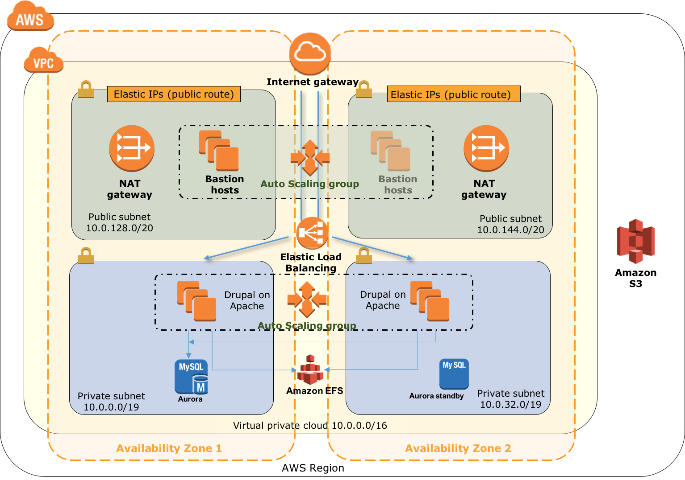

# quickstart-drupal

This Quick Start automatically delpyos Drupal on the AWS Cloud. This Quick Start allows the user to choose between [Drupal-7](https://www.drupal.org/drupal-7.0) and [Drupal-8](https://www.drupal.org/8).

[Drupal](https://www.drupal.org/) is content management software. It's used to make many of the websites and applications you use every day. Drupal has great standard features, like easy content authoring, reliable performance, and excellent security. But what sets it apart is its flexibility; modularity is one of its core principles. Its tools help you build the versatile, structured content that dynamic web experiences need.

It's also a great choice for creating integrated digital frameworks. You can extend it with any one, or many, of thousands of add-ons. Modules expand Drupal's functionality. Themes let you customize your content's presentation. Distributions are packaged Drupal bundles you can use as starter-kits. Mix and match these components to enhance Drupal's core abilities. Or, integrate Drupal with external services and other applications in your infrastructure. No other content management software is this powerful and scalable.

The Drupal project is open source software. Anyone can download, use, work on, and share it with others. It's built on [principles](https://www.drupal.org/about/mission-and-principles) like collaboration, globalism, and innovation. It's distributed under the terms of the [GNU General Public License](http://www.gnu.org/copyleft/gpl.html) (GPL). There are [no licensing fees](https://www.drupal.org/about/licensing), ever. Drupal will always be free.

